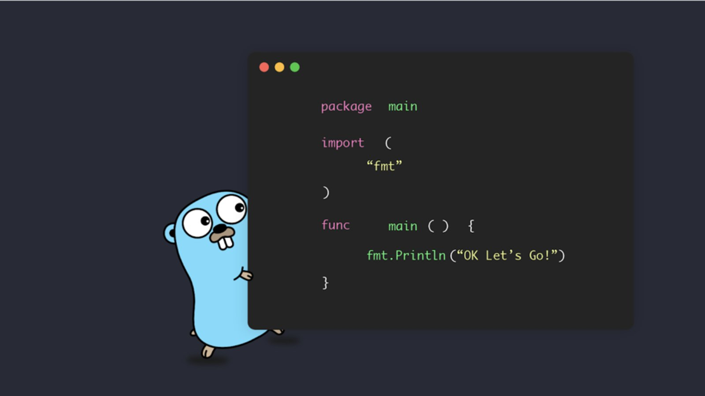

# Go Clean Architecture With Fiber

This repository is Golang implementation of Clean Code Architecture using Fiber framework.

## HTTP Methods for RESTful APIs

| HTTP Method | Description                         |
| ----------- | ----------------------------------- |
| GET         | Retrieve a resource.                |
| POST        | Create a new resource.              |
| PUT         | Update a resource (full update).    |
| PATCH       | Update a resource (partial update). |
| DELETE      | Remove a resource.                  |

## Error Handling and Standard HTTP Status Codes

| Status Code               | Description                                       |
| ------------------------- | ------------------------------------------------- |
| 200 OK                    | Successfully returned data.                       |
| 201 Created               | Successfully created a resource.                  |
| 204 No Content            | Successfully deleted a resource.                  |
| 400 Bad Request           | Invalid request (e.g., malformed JSON).           |
| 401 Unauthorized          | Authentication required.                          |
| 403 Forbidden             | Access denied.                                    |
| 404 Not Found             | Resource not found.                               |
| 409 Conflict              | Conflict with the current state of a resource.    |
| 422 Unprocessable Entity  | Validation or processing error.                   |
| 500 Internal Server Error | Server encountered an error.                      |
| 503 Service Unavailable   | Server temporarily unavailable.                   |

## Tech Stack & Tools

- Framework: [Fiber](https://gofiber.io)
- Database: [PostgreSQL](https://github.com/go-gorm/postgres)
- ORM: [GORM](https://gorm.io)
- Config: [Viper](https://github.com/spf13/viper)
- Validator: [Go Validator](https://github.com/go-playground/validator)
- Log: [Logrus](https://github.com/sirupsen/logrus)
- APIs Docs: [Swagger](https://github.com/gofiber/swagger)
- Container: [Docker](https://www.docker.com)

## Author

[Dicki D. Saputra](http://github.com/dickidarmawansaputra)
